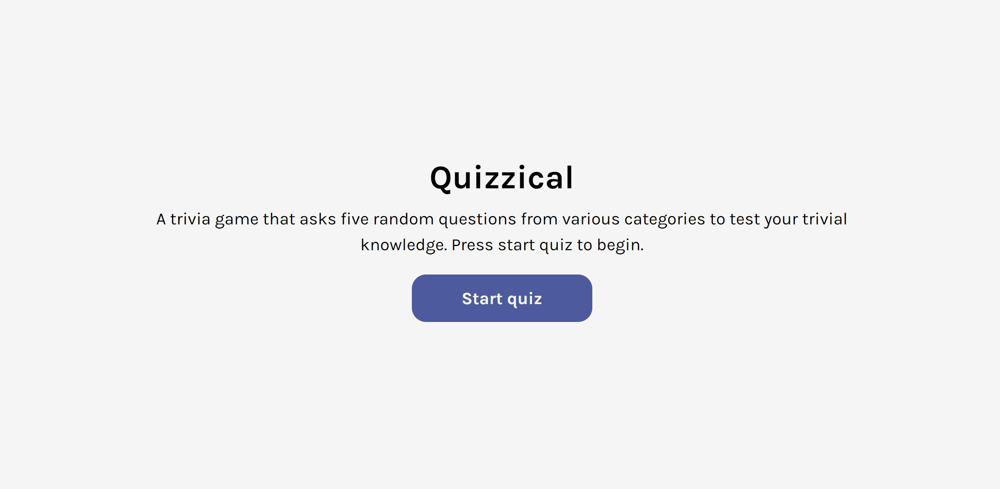
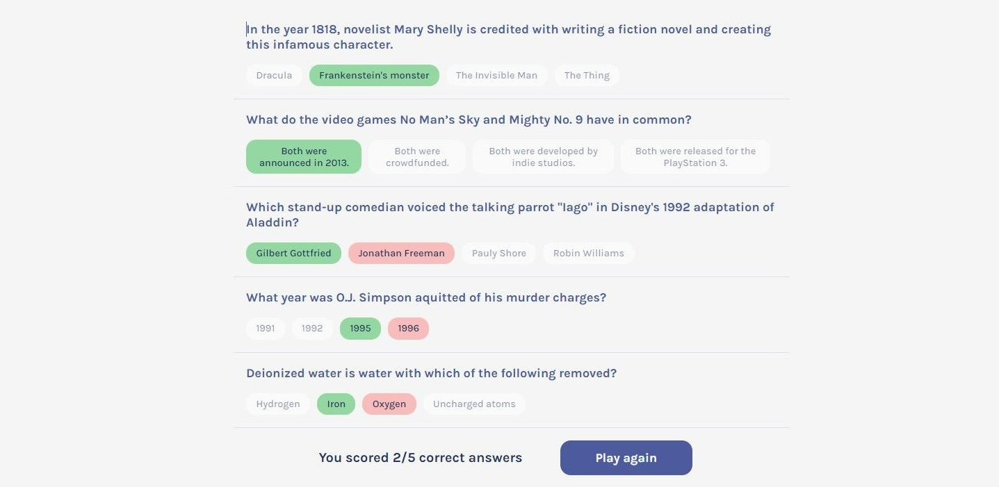

# Quizzical

Quizzical is a trivia site that uses the Open Trivia database API to load random questions for the user to answer and then verifies if they are correct. The site was created using HTML, CSS, JavaScript, and React.

### Screenshot

Desktop view

### Links

- Solution URL: [GitHub repo](https://github.com/ElizabethLankford/Quizzical)
- Live Site URL: [Live site URL here](https://quizzical-el.netlify.app/)

### Built with

- HTML, CSS, JavaScript, Vite, & React
- Open Trivia Database API

### Useful resources

- Open Trivia Database API - [Trivia API](https://opentdb.com/api_config.php)

## Author

- Website - [Elizabeth Lankford](https://elizabeth-lankford.com/)
- Frontend Mentor - [@ElizabethLankford](https://www.frontendmentor.io/profile/ElizabethLankford)
- LinkedIn - [Elizabeth Lankford](https://www.linkedin.com/in/elizabethlankford/)
